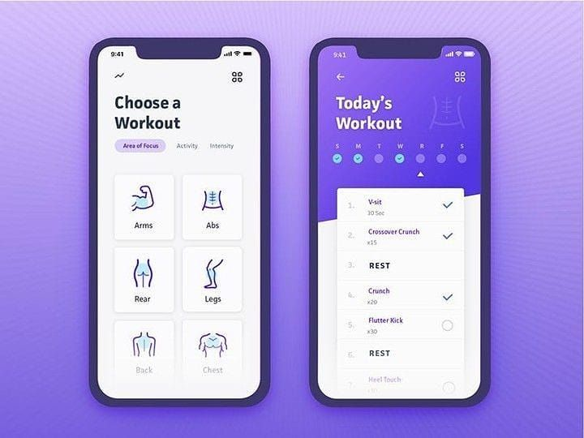

<h2 align="center">
  
  <br/>
  <b>Gym Academy</b>
  <br/>
  
</h2>

## O que é? :question:

> App para organizar os treinos na academia
>
> ### é apenas um prototipo

## O que utiliza? :hammer:

- Ferramentas
  - Expo/React-Native
  - Typescript
  - Styled-components
  - React-Navigation

## Como rodar? :stop_button:

```bash
git clone https://github.com/Ryannnkl/Gym-Desing.git

cd Gym-Desing

npm install

expo start ## ou yarn start se você utiliza yarn
```

## Inspirado no desing :paperclip:

<h3 align="end">
  
</h3>
